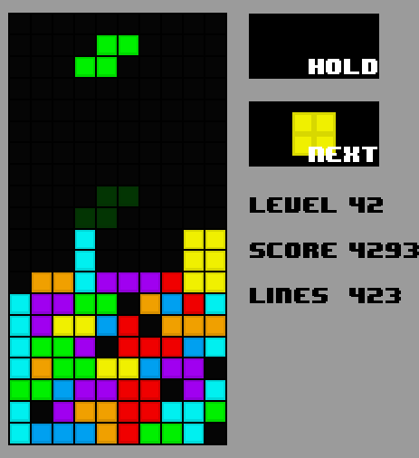

# Tetris
Tetris with a Deep Q Network. 

In the GIF below the computer manages to clear 1000+ lines.

## How it works
### Reinforcement learning
[Reinforcement learning](https://en.wikipedia.org/wiki/Reinforcement_learning) is used to determine what *action* should be taken that would maximize *reward* when given a *state*. 

#### State
I experimented with two different state types to find the most suitable one.

At first a two dimensional array of the board was used, but it didn't turn out to be feasible as the neural network had to be way more complex to be able to start detecting any patterns.

Ultimately, it was decided to use a state based on the statistics of the board after a potential action. All predictions would be compared but the action with the best state would be used.
The reason why some of the statistics below are chosen is due to Dellacherie's algorithm.

| Name  | Description |
| ---: | :--- |
| Holes  | Number of empty cells covered by a full cell  |
| Landing height  | Height where the last piece is added  |
| Eroded piece cells  | (Rows cleared) × (Cells removed from the last piece) |
| Row transitions  | Number of horizontal cell transitions  |
| Column transitions  | Number of vertical cell transitions  |
| Cumulative wells  | The sum of all wells  |
| Bumpiness | A total of the difference between the height of each column  |
| Aggregate height | Sum of the heights of each column  |
| Rows cleared  | The amount of rows cleared  |

#### Reward
Rewards are based on the original Tetris game but reward is also given when the actor stays alive and taken when losing.

| Name  | Reward |
| ---: | :---: |
| Alive  | +1  |
| Clearing 1 Row  | +40  |
| Clearing 2 Rows  | +100  |
| Clearing 3 Rows  | +300  |
| Clearing 4 Rows  | +1200  |
| Game Over  | -5  |

#### Action
As mentioned before it compares all possible states to find the one that would result in the highest reward. 
The action that would result in the best board state will be chosen.
The action is just a tuple of the rotation count (0 to 3) and the column (0 to 9) that the piece should drop at. 

### Q-Learning
If Q-Learning was not used the neural network would prefer to get immediate reward rather than future rewards. 
In our case the actor would want to clear a row even if it would mean creating an obstacle which would be bothersome for the rest of the game.
That is why it is important to use Q-Learning.

### Training
At first the AI explores by selecting random actions.
Every episode it will train itself with randomly selected experiences from previous games (and also applying Q-Learning).
Slowly it will shift from mostly exploration to exploitation which means that the neural network will chose the actions.

After thousands of episodes the AI has learned how to play Tetris a thousand times better than me.  

## How to run
Run `run_human.py` if you'd like to play Tetris.

Run `run_play_ai.py` if you'd like to see the AI play Tetris.

Run `run_train_ai.py` if you'd like to train the AI.

Run `run_performance.py` to see how many games and frames per second it has using randomized actions.

## Links
Explanations for statistics

[Building Controllers for Tetris](https://pdfs.semanticscholar.org/e6b0/a3513e8ad6e08e9000ca2327537ac44c1c5c.pdf)

[Tetris Agent Optimization Using Harmony Search Algorithm](https://hal.inria.fr/inria-00418954/file/article.pdf)

